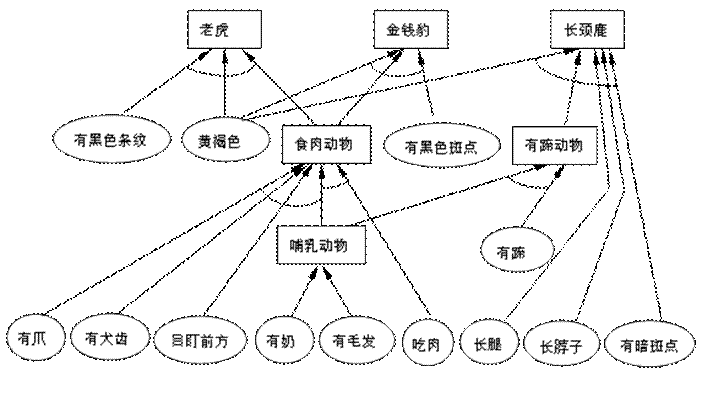
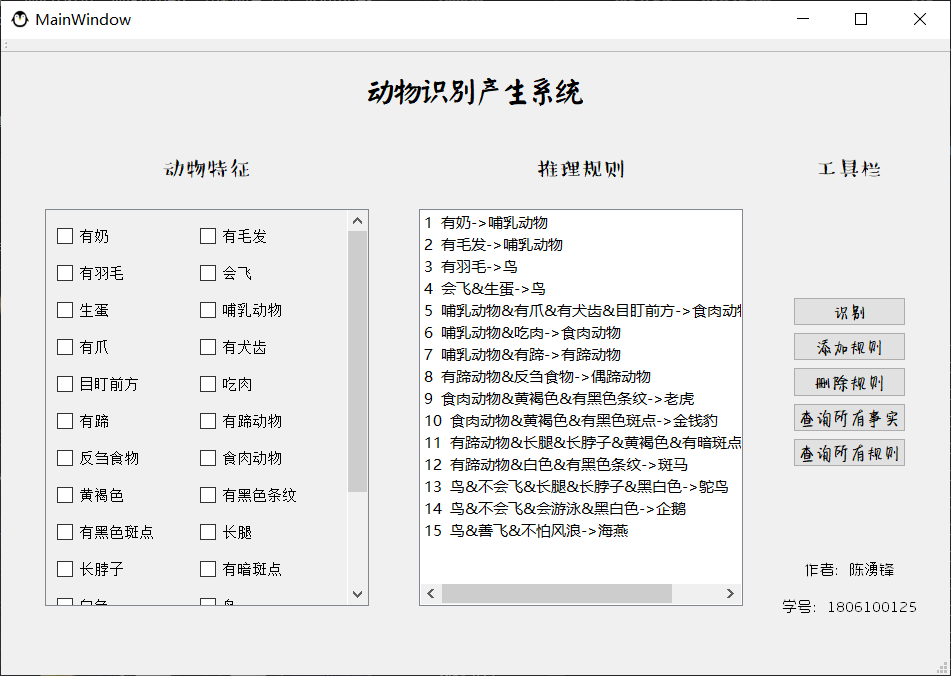

[toc]

# 动物识别产生式系统

- Author: 浅若清风cyf
- Blog: https://blog.csdn.net/weixin_44002829
- Date: 2020/11/20

## 前言与环境

- 本文是GZHU人工智能实验课的一个实验——**产生式系统推理**

- 本文采用Qt5.9框架实现
- 编程工具：Qt Creator 4.3.0 Community
- 编译工具：MinGW53

## 内容

### （一）、问题

以动物识别系统为例，用选定的编程语言建造规则库和综合数据库，开发能进行正确的正向推理或反向推理的推理机。

- 正向推理过程

从已知事实出发，通过规则库求得结论，或称数据驱动方式。推理过程是：

Ø 规则集中的规则前件与事实库中的事实进行匹配，得匹配的规则集合。

Ø 从匹配规则集合中选择一条规则作为使用规则。

Ø 执行使用规则的后件，将该使用规则的后件送入事实库中。

Ø 重复这个过程直至达到目标。 

 **1** **动物分类规则集**

   （1）若某动物有奶，则它是哺乳动物。

   （2）若某动物有毛发，则它是哺乳动物。

   （3）若某动物有羽毛，则它是鸟。

   （4）若某动物会飞且生蛋，则它是鸟。

   （5）若某动物是哺乳动物且有爪且有犬齿且目盯前方，则它是食肉动物。

   （6）若某动物是哺乳动物且吃肉，则它是食肉动物。

   （7）若某动物是哺乳动物且有蹄，则它是有蹄动物。

   （8）若某动物是有蹄动物且反刍食物，则它是偶蹄动物。

   （9）若某动物是食肉动物且黄褐色且有黑色条纹，则它是老虎。

   （10）若某动物是食肉动物且黄褐色且有黑色斑点，则它是金钱豹。

   （11）若某动物是有蹄动物且长腿且长脖子且黄褐色且有暗斑点，则它是长颈鹿。

   （12）若某动物是有蹄动物且白色且有黑色条纹，则它是斑马。

   （13）若某动物是鸟且不会飞且长腿且长脖子且黑白色，则它是驼鸟。

   （14）若某动物是鸟且不会飞且会游泳且黑白色，则它是企鹅。

   （15）若某动物是鸟且善飞且不怕风浪，则它是海燕。

下面是该规则集所形成的（部分）推理网络：

*****

-  由上述动物识别规则组成规则库，推理机采用正向推理算法或反向推理算法，实现对动物的查询。

如给出初始事实：

F1：某动物有毛发

F2：吃肉

F3：黄褐色

F4：有黑色条纹

目标条件为：该动物是什么？

**3** **规则库扩充 (选做)**

  在上述规则集(Ⅰ)基础上增加以下规则集(Ⅱ)：

（1）兔子：有毛发，有奶，善跳跃，唇裂；

（2）猫：有毛发，有奶，善捕鼠，脚有肉垫；

（3）犀牛：有毛发，有奶，鼻子上有角，褐色，皮糙肉厚，有蹄；

（4）熊猫：有毛发，有奶，黑眼圈，四肢短小；

（5）鹦鹉：鸟类，上嘴鹰钩，会模仿人说话；

（6）鸭子：鸟类，腿短，嘴扁平，善潜水游泳；

（7）鹰：鸟类，上嘴鹰钩，有爪，吃肉；

（8）鸭子：有羽毛，卵生，善游泳，嘴扁平，腿短；

（9）鹅：有羽毛，卵生，善潜水游泳，白色或黑色，颈长，嘴大，腿长，颈部有肉只凸起；

（10）鸦：有羽毛，卵生，黑色，嘴大；

（11）鹰：有羽毛，卵生，有爪，吃肉，上嘴鹰钩；

（12）鹦鹉：有羽毛，卵生，上嘴鹰钩，能模仿人说话；

（13）青蛙：卵生，生活在水中，生活在陆地，有皮肤呼吸，用肺呼吸，皮肤光滑，吃昆虫，会变色；

（14）蝾螈：卵生，生活在水中，生活在陆地，有皮肤呼吸，用肺呼吸，吃昆虫，皮肤粗糙，四肢扁，背部黑色；

（15）蟾蜍：卵生，生活在水中，生活在陆地，有皮肤呼吸，用肺呼吸，吃昆虫，皮肤粗糙；

（16）比目鱼：用鳃呼吸，身体有鳍，生活在海洋中，身体扁平，两眼在头部同侧；

（17）鲫鱼：用鳃呼吸，身体有鳍，生活在淡水中，身体扁平，头高尾部窄；

（18）蛇：生活在陆地，用肺呼吸，胎生，身体有鳞或甲，身体圆而细长，吃小动物；

（19）壁虎：生活在陆地，用肺呼吸，胎生，身体有鳞或甲，有四肢，尾巴细长易断，吃昆虫；

（20）乌龟：生活在陆地，用肺呼吸，胎生，身体有鳞或甲，身体圆而扁，有坚硬的壳；

（21）玳瑁：生活在陆地，用肺呼吸，胎生，身体有鳞或甲，壳为黄褐色，皮肤光滑，有黑斑；

（22）鳄鱼：生活在陆地，用肺呼吸，胎生，身体有鳞或甲，有四肢，善游泳，皮硬黑褐色。

要求在动物分类规则集(Ⅰ)的基础上添加上述22条知识，共构成29种动物的知识库系统，对原有动物分类系统进行扩充和修改。

### （二）要求

1 以产生式推理模式为基础，实现动物分类系统，推理方法采用正向推理或反向推理；

2 要求表示规则的语言必须能体现出规则前提和结论的对应关系，必须能体现出前提和结论中的逻辑关系；

3 要求能对规则库进行动态地增加、删除和修改操作（选做）；

4要求有用户交互，如界面等输入要查询的初始事实、推理方法、推理中用到的规则和结论。

## 软件界面截图

- 主界面

- 添加规则

  